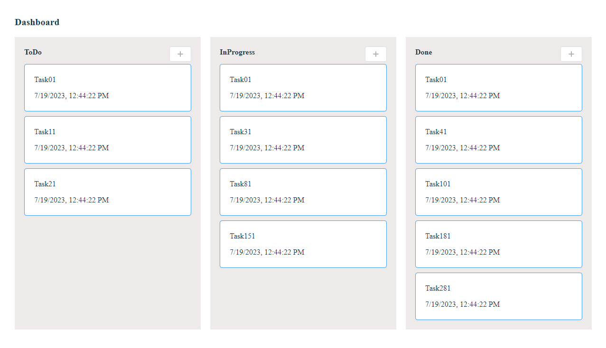

# Vue 3 + TypeScript + Vite + VueDraggableNext + Element-plus
Simple project analogy for jira. The project contains some mock data. There is 3 columns with ToDo, InProgress and Done statuses. Added drag & drop functionality

## Recommended Setup
```
pnpm i
pnpm run dev
```

## Result:

